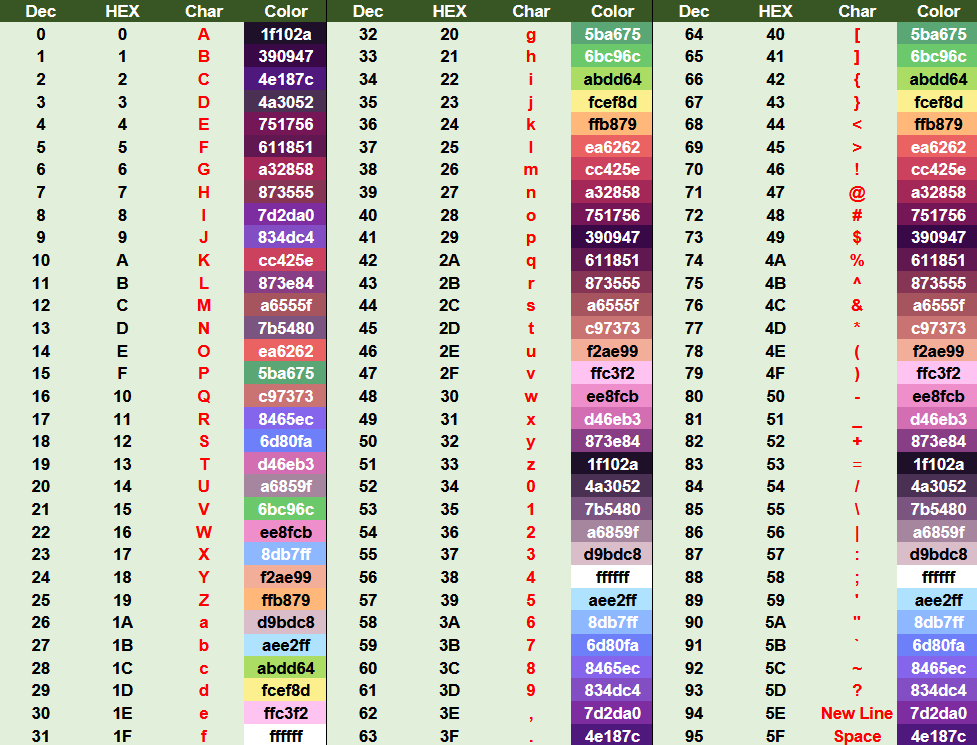

This is my first C# project.


SquarePixelLang is a small esoteric scripting language that runs on a fixed 16x16 pixel grid. Every script manipulates a single **pointer** that addresses one of 256 pixels, and every pixel holds an **index** (a value from `00` to `5F` in hex) that maps to a color **and** character.

This document covers everything you need to write and run SqPiLang scripts.

---
## 1. Setup Environment

SqPiLang has editor support for Sublime Text.

### 1.1 Import Packages

Open Sublime Text, then open the `User` package folder via:

```
Prefrences -> Browse Packages... -> User
```

Move the files from the installed `Sublime Packeges` folder to that Sublime's `User` packages folder.

### 1.2 Editing Build File

Once you place the packages, open `SqPiLang.sublime-build`.

You should see:

```
{
    "cmd": ["cmd", "/c", "start", "", "ENGINE_PATH", "$file", "INSTRUCTIONS_PER_FRAME"],
    "selector": "source.sqpi",
    "working_dir": "$file_path"
}
```

1. Replace `ENGINE_PATH` with your SqPiEngine path.
2. Replace `INSTRUCTIONS_PER_FRAME` with how many instructions you want the interpreter to run per frame **(200 recommended)**.

### 1.3 Running Script

After you finish writing your script, press `Ctrl+B` to run it.

---
## 2. Quick Start

Every SqPiLang script is a plain text file with the extension `.sqpi`.

**Every script must start with exactly one line:**

```
scriptstart
```

This is a required header — the interpreter will throw an error if the first executed line isn't exactly `scriptstart`.

**Your first script** — prints **Hello, World!**:

```
scriptstart

pixel 0 7
logchar
pixel > 1E
logchar
pixel > 25
logchar
pixel > 25
logchar
pixel > 28
logchar

pixel > 3E
logchar
pixel > 5F
logchar

pixel > 16
logchar
pixel > 28
logchar
pixel > 2B
logchar
pixel > 25
logchar
pixel > 1D
logchar
pixel > 46
logchar
```

**Running a script:**

```
SqPiEngine.exe scriptpath.sqpi
```

**(Optional)** You can pass a second argument to set how many instructions execute per frame (200 is default):

```
SqPiEngine.exe scriptpath.sqpi 1000
```

This will open a 16x16 windows (scaled up to 512x512) and begins executing the script, looping back to the top once it finished the last line (unless it was called via `runscript`, see section 5).

---

## 3. Core Concepts

### 3.1 The Grid and the Pointer

The screen is a 16x16 grid of pixels (256 pixels total), indexed **0 to 255**, Starting from top-left; index increases left-to-right, then go back to 0 if after it reaches 255.

A single pointer (0-255) always points at exactly one pixel.

### 3.2 Pixel Values and the Palette

Each pixel stores a value between `00` and `5F` (0-95 decimal). This index maps to:

- A **color** (via the engine's 96-entry color table) — what actually gets drawn to screen.
- A **character** — used by `logchar` and input-related instructions.

Palette indices are written in **hex** in scripts (e.g. `3A`, `5F`, `00`), without a `0x` prefix or `#`.

### 3.3 Comments

Lines starting with `#` are comments and are ignored.

```
# This is a comment
pixel 0   # inline comments are NOT supported — the whole line must start with #
```

---

## 4. Instruction Reference

### `pixel <arg>`

Moves the pointer.

| Argument       | Effect                                                            |
| -------------- | ----------------------------------------------------------------- |
| a number 0-255 | jumps the pointer directly to that index                          |
| `>`            | moves pointer right by 1 (wraps 255 → 0)                          |
| `<`            | moves pointer left by 1 (wraps 0 → 255)                           |
| `^`            | moves pointer up one row (blocked if already in the top row)      |
| `v`            | moves pointer down one row (blocked if already in the bottom row) |

Optional second argument: `pixel <arg> <value>` also sets the pixel value at the new position in one line (equivalent to `pixel <arg>` followed by `pixelvalue <value>`).

```
pixel 34        # jump directly to index 34
pixel >         # move right one
pixel v 3A      # move down one row, then set that pixel's value to 3A
```

---

### `pixelvalue <arg>`

Changes the value of the pixel currently under the pointer.

| Argument              | Effect                                                                                     |
| --------------------- | ------------------------------------------------------------------------------------------ |
| a hex value `00`-`5F` | sets the pixel to that palette index                                                       |
| `++`                  | increments the pixel's value (wraps past the max back to `00`)                             |
| `--`                  | decrements the pixel's value (wraps past `00` to the max)                                  |
| `INPUT`               | waits until any mapped key is pressed, then stores that key's palette index into the pixel |

```
pixelvalue 3A
pixelvalue ++
pixelvalue INPUT     # blocks until a key is pressed
```

---

### `pixeldraw`

Draw pixel changes on screen. Takes no arguments.

```
pixeldraw
```

---

### `log`

Prints the hex value of the pixel currently under the pointer to the console. Takes no arguments.

### `logchar`

Prints the **character** mapped to the pixel's value. Takes no arguments.

---

### `store`

Copies the value of the pixel under the pointer into a single internal register. Takes no arguments.

### `restore`

Writes the stored register value back into the pixel currently under the pointer. Takes no arguments.

### `reset`

Sets the pixel currently under the pointer to `00`. Takes no arguments.

```
store           # save current pixel's value
pixel 10
restore         # write that saved value into pixel 10
```

---

### `clear <value>`

Sets **every** pixel in the screen to the given hex value.

```
clear 00        # blank the whole screen
```

---

### `detectinput <key> --> <instruction...>`

Checks if a key is currently held down. If true, executes the rest of the line.

- `<key>` is a hex value (`0`-`5F`) identifying which key to check.
- Prefixing the key with `!` inverts the check.

```
detectinput 20 --> pixeldraw
detectinput !20 --> log
```

### `detectpixel <value> --> <instruction...>`

Checks if the pixel under the pointer currently equals a given hex value. `!` inverts the check.

```
detectpixel !3A --> log
```

### `detectpixelnum <value> --> <instruction...>`

Checks if the pointer index equals a given decimal value (0-255). `!` inverts the check.

```
detectpixelnum 123 --> quit
```

### `_ <instruction...>` and `!_ <instruction...>`

Runs only if the **most recent** `detectinput`/`detectpixel`/`detectpixelnum` check succeeded (`_`) or failed (`!_`).

```
detectinput 20 --> pixel 255 2D
_ pixeldraw
!_ quit
```

### `resetdetect`

Clears the remembered result of the last detect check. Takes no arguments.

---

### `waitinput <key>`

Stops the script until the given key is pressed (`0`-`5F`). `!` inverts it (waits until the key is released).

```
waitinput 20
log            # only runs once the key is pressed
```

---

### `jump <line>`

Jumps directly to the given line number.

```
jump 5
```

### `runscript <path>`

Runs another `.sqpi` file as a subroutine. Execution switches entirely to the target script. When the called script reaches its last line, the parent script continues executing.

```
runscript square.sqpi
log             # runs after square.sqpi finishes completely
```

Calls can be nested.

---

### `quit`

Immediately exits the program. Takes no arguments.

---

## 5. Reference: Palette and Characters

- Palette indices run from `00` to `5F` (0-95 decimal), each mapping to one of 96 colors (a 32-color set repeated three times).
- The same indices map to a 96-character table.


